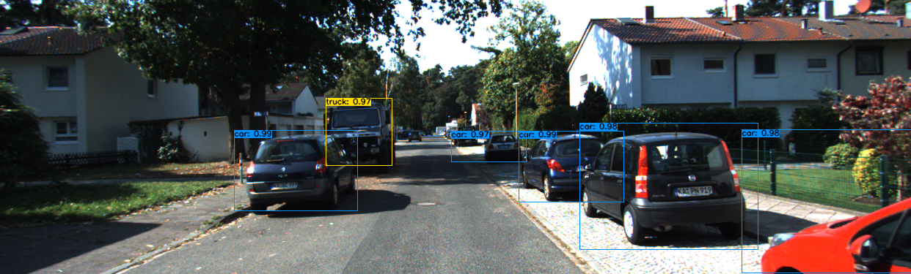

# YOLOv4 on KITTI Dataset
Training the KITTI dataset using yolov4 for object detection tasks in autonomous driving. 
The project includes: conversion of dataset to TFRecord format, YOLOv4 implementation, training, detection and evaluation.
YOLOv4 Implemented in Tensorflow 2.0. 

## Prerequisites
- Opencv-python 4.1.2.30
- Tensorflow 2.5.0
- Download yolov4.weights file
   - https://github.com/AlexeyAB/darknet/releases/download/darknet_yolo_v3_optimal/yolov4.weights
   - Put it in the main directory

## Directory Structure

Download models of all the three input size: https://drive.google.com/file/d/17-mGdc98RZurb-DIi9rKX9ddGR6-7uVK/view?usp=sharing

yolov4-kitti
├─ checkpoints  
├─ core
│  ├─ backbone.py
│  ├─ common.py
│  ├─ config.py
│  ├─ dataset.py
│  ├─ readtfr.py
│  ├─ utils.py
│  └─ yolov4.py
├─ detect_results
├─ models
│  ├─ 416
│  ├─ 512
│  ├─ 608
├─ results
├─ training
│  ├─ image_2
│  ├─ kitti_tfrecords
│  ├─ label_2
│  ├─ kitti.names
│  ├─ train.txt
│  ├─ val.txt
├─ convert_into_tfrecord.py
├─ detect.py
├─ detect_val.py
├─ train.py
├─ yolov4.weights
├─ requirements.txt

## Demo
### Conversion to TFRecord format
The training images of the kitti dataset (directory: *./data_object_image_2/training/image_2*) and the corresponding labels folder (*./data_object_label_2/label_2*) into our project's directory *./training/*.

```bash
## Convert source data to tfrecord format
python convert_into_tfrecord.py --data_dir ./training/ --output_path ./training/kitti_tfrecords/
```

Divide the whole dataset into train set and val set and save them as TFRecord files respectively.

### Training YOLOv4

Please check the parameter settings in *./core/config.py* before training.
Training using pre-trained weights file *yolov4.weights*.
Training data from train.tfrecord.


```bash
python train.py --model yolov4 --weights ./yolov4.weights
```

The model parameter weights are saved in the checkpoints folder and the full model is saved in the models folder.

### Detection

```bash
## Detect all the images in the val set and output the txt files of the detection results
python detect_val.py --weights ./models/416 --size 416
```

The detection results are saved in the detect_results folder.
To get a visualization of the detection results, run:
```bash
python detect.py --weights ./models/416 --size 416
```

## Output



## Evaluation

This part is based on the [KITTI object development kit](http://www.cvlibs.net/datasets/kitti/eval_object.php) and project [eval_kitti](https://github.com/cguindel/eval_kitti) from [cguindel](https://github.com/cguindel).
For more information see project eval-kitti.

| Input Size | mAP(Car&Easy) | FPS  |
| ---------- | ------------- | ---- |
| 416×416    | 60.54         | 24.6 |
| 512×512    | 73.59         | 23.8 |
| 608×608    | 84.75         | 22.6 |


## References

  * YOLOv4: Optimal Speed and Accuracy of Object Detection [YOLOv4](https://arxiv.org/abs/2004.10934).

   Our project is inspired by this previous YOLOv4 implementations:
  * [tensorflow-yolov4-tflite](https://github.com/hunglc007/tensorflow-yolov4-tflite)

